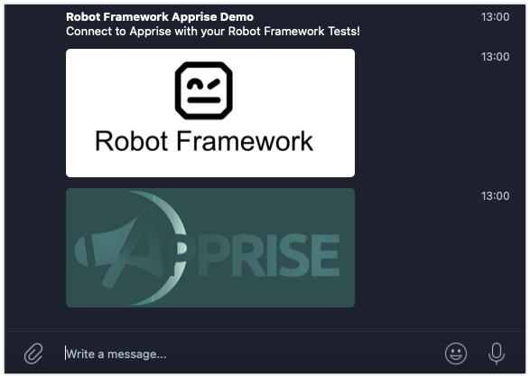

# robotframework-apprise
[](https://www.gnu.org/licenses/gpl-3.0) [](https://github.com/psf/black)

```robotframework-apprise``` is a [Robot Framework](https://www.robotframework.org) keyword collection for the [Apprise](https://github.com/caronc/apprise) push message library. It enables Robot Framework users to send push/email messages to every message service supported by Apprise.



## Installation

- clone repository
- ``pip install -r dependencies.txt``

## Robot Framework Library Example

In order to run the example code, you need to provide at least one valid target messenger. Have a look at [Apprise's list of supported messengers](https://github.com/caronc/apprise/wiki)

- [send_apprise_message.robot](src/send_apprise_message.robot)

## Library usage and supported keywords

| Keyword|Description|
|------- |-----------|
|``Send Apprise Message``|Sends a push message through Apprise|
|``Set Clients`` and ``Set Attachments``|Sets a new value list and replace the previous values|
|``Add Client`` and ``Add Attachment``|Adds a value to an existing list|
|``Remove Client`` and ``Remove Attachment``|Removes a value from an existing list (if present)|
|``Clear All Clients`` and ``Clear All Attachments``|Completely removes the current values from the respective list|
|``Set Delimiter``|Optional reconfiguration of this Robot Framework library's delimiter. See details below|


All ``clients`` and ``attachments`` options can be passed as a ``List`` type variable or as a string. If you use a string, the default delimiter is a comma ``,``. In case you need to use a different delimiter, use the ``Set Delimiter`` keyword.

``Attachments`` are purely optional. Providing at least one ``Client`` is mandatory, though. Both ``Attachments`` and ``Clients`` can either be provided as a ``List`` item or as a separated string.

Examples:

        # Send a message with one client and a List which contains our images
        @{IMAGE_LIST}=          Create List     http://www.mysite.com/image1.jpg    http://www.mysite.com/image2.jpg
        Send Apprise Message    title=Robot Framework Apprise Demo   body=Connect to Apprise with your Robot Framework Tests!    clients=<apprise_client>     attachments=${IMAGE_LIST}

        # Send a message with one client. Our attachments use a comma-separated string (default)
        Send Apprise Message    title=Robot Framework Apprise Demo   body=Connect to Apprise with your Robot Framework Tests!    clients=<apprise_client>     attachments=http://www.mysite.com/image1.jpg,http://www.mysite.com/image2.jpg

        # Send a message with one client. Our attachments use a custom delimiter ^
        Set Delimiter            ^
        Send Apprise Message    title=Robot Framework Apprise Demo   body=Connect to Apprise with your Robot Framework Tests!    clients=<apprise_client>     attachments=http://www.mysite.com/image1.jpg^http://www.mysite.com/image2.jpg


## Known issues

- This library uses Apprise's default async behavior. Currently, you cannot send messages in a synchronous way.
- The current version of this library does not permit you to set the target format (text, HTML). It uses Apprise's default format which is HTML.
